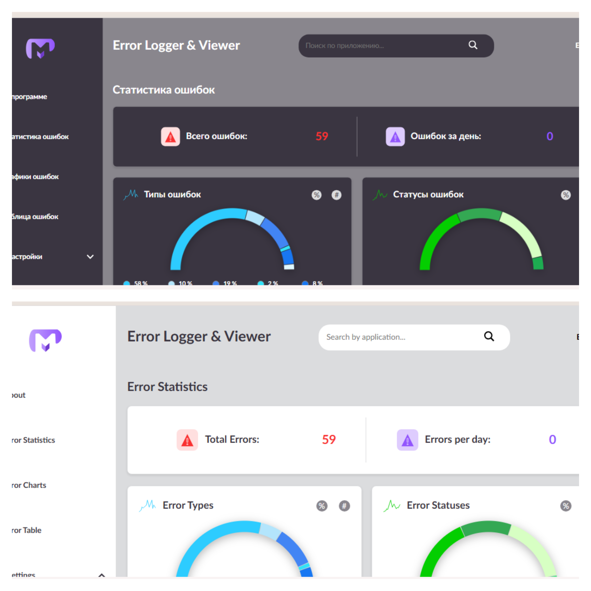
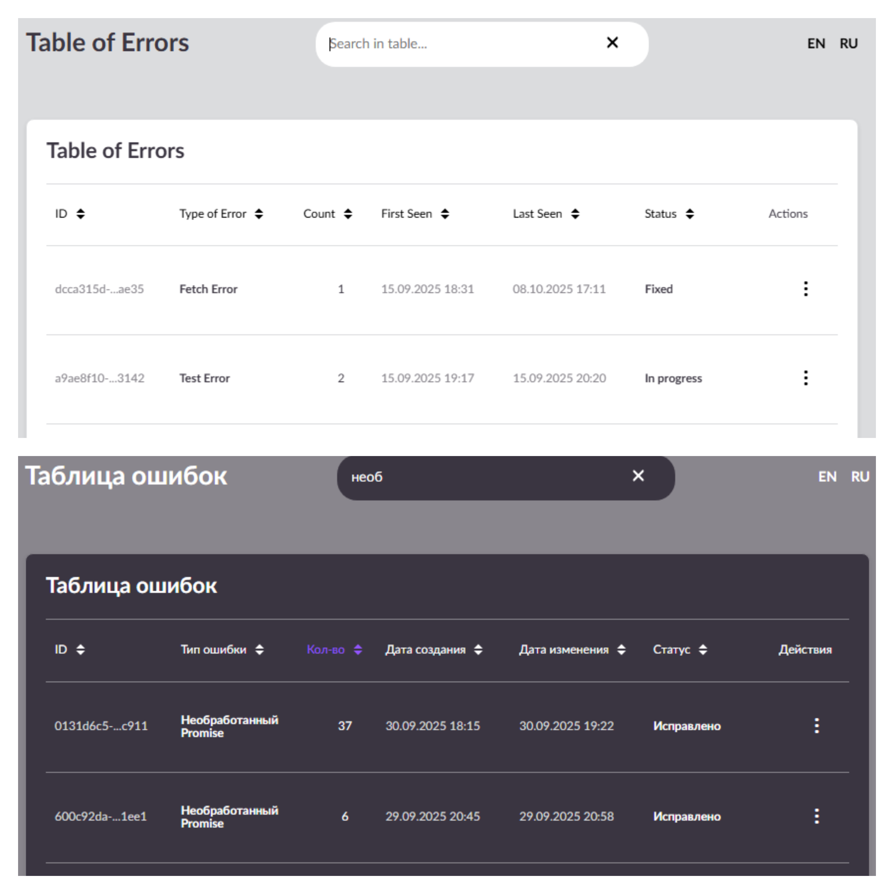
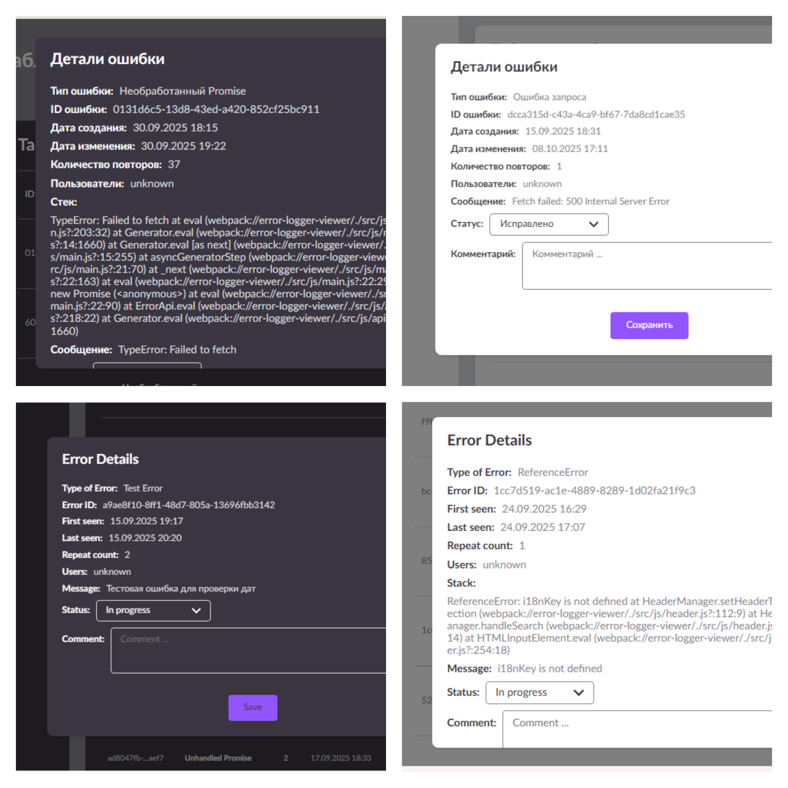
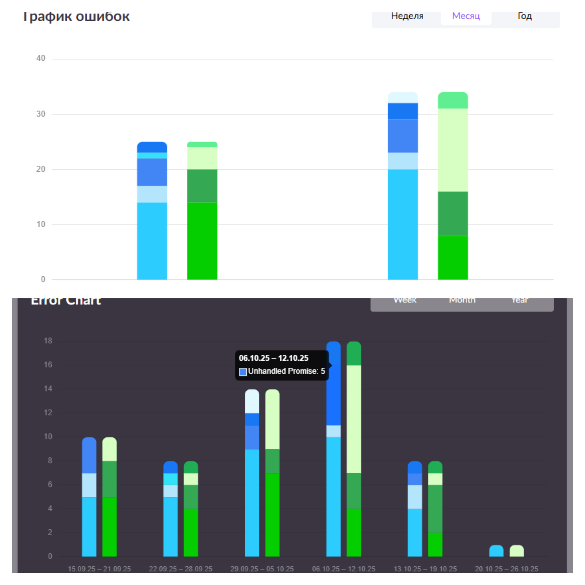

# Error Logger & Viewer

[](https://github.com/kate8382/error-logger-viewer/actions)
[](https://github.com/kate8382/error-logger-viewer/actions)

**Error Logger & Viewer** is a modern SPA, migrated to TypeScript, for collecting, storing, analyzing, and visualizing JavaScript errors in web projects. Source files are in `src/` and use `.ts` modules. It is designed for developers and teams who need to quickly identify, group, and track errors in production or test environments.

Live demo: https://kate8382.github.io/error-logger-viewer/ — try the "Create test error" button on the demo page to see the app in action.

Read the short case study on Dev.to: https://dev.to/kate8382/error-logger-viewer-tiny-spa-for-tracking-js-errors-12mk

Quick start: follow the commands below to run the project locally. For contribution guidelines see [CONTRIBUTING.md](CONTRIBUTING.md).

## Purpose

The application allows you to:
- Automatically collect JS errors, resource loading errors, unhandled promises, and fetch errors.
- Store errors on the server or in local storage (demo mode).
- View statistics by type, status, date, and a detailed error table.
- Quickly filter, sort, and comment on errors.
- Track error status (new, in progress, fixed, ignored).
- Work in two languages: Russian and English.

---

## Main Features

- **Global error collection:**
	Uses global handlers (window.onerror, window.onunhandledrejection), fetch interception, and resource load error tracking.
- **Flexible filtering and sorting:**
	Search by application, filter by section, sort by any field.
- **Visualization:**
	Charts by day/week/month/year, doughnut charts by type and status.
- **Multilanguage:**
	All texts and UI are dynamically translated (`i18n.ts`).
- **Modes:**
	Server (Node.js + Express + LowDB) and demo (localStorage).
- **Edit and delete errors:**
	Through modals with comments and status change support.
- **Responsive design:**
	Adapts to any device and screen size.
- **Accessibility:**
	ARIA-labels, keyboard navigation for better usability.

---

## Screenshots

<p align="center">
	<figure style="display:inline-block; margin:12px;">
		
		<figcaption align="center">Main dashboard — overview of error statistics, quick filters and light/dark theme examples.</figcaption>
	</figure>
</p>

<p align="center">
	<figure style="display:inline-block; margin:12px;">
		
		<figcaption align="center">Error table with search and filter — showing sortable columns and action menu for each row.</figcaption>
	</figure>
</p>

<p align="center">
	<figure style="display:inline-block; margin:12px;">
		
		<figcaption align="center">Error details modal — view full stack, change status and add comments.</figcaption>
	</figure>
</p>

<p align="center">
	<figure style="display:inline-block; margin:12px;">
		
		<figcaption align="center">Charts view — stacked bar charts and period selector (week/month/year) for error dynamics.</figcaption>
	</figure>
</p>

---

## How to Use

1. Installation
 - Ensure Node.js (16+) and npm are installed.
 - From repo root install dependencies:

```powershell
npm ci
```

2. Development
 - Start backend only:

```powershell
npm run dev:backend
```

 - Start frontend dev server only:

```powershell
npm run dev:frontend
```

 - Start both backend and frontend concurrently:

```powershell
npm run start:all
```

3. Production preview
 - Build frontend and serve `frontend/dist` locally:

```powershell
npm run build:frontend
npm run serve:dist:frontend
```

2. **Error collection**
	 - All errors are automatically logged when they occur on the page.
	 - For testing, you can create an error manually ("Create test error" button at the bottom of the page).

3. **Navigation**
	 - Sidebar: switch between sections (About, Statistics, Charts, Error Table, Settings).
	 - Header: search by application, language switch, quick access to filters.

4. **Working with errors**
	 - In the table, you can sort, filter, edit, and delete errors.
	 - The modal window provides details, comments, and status change.

5. **Analytics**
	 - "Statistics" section — quick overview by type and status.
	 - "Charts" section — error dynamics over time.

---

## Architecture & Technical Details

- **Frontend (src/scripts):**
	- `main.ts` — app initialization, global error handlers, API integration.
	- `api.ts` — universal API client for server/localStorage.
	- `header.ts` — header management, search, filtering, localization.
	- `aside.ts` — sidebar logic, language/theme/mode switching.
	- `table.ts` — error table rendering and management.
	- `stats.ts` — statistics calculation and visualization.
	- `charts.ts` — chart building by period.
	- `modal.ts` — modals for editing and deleting errors.
	- `i18n.ts` — all translatable UI strings.
	- `utils/` and `shared/` — TypeScript utility modules and shared helpers (`*.ts`).

- **Backend (backend/server.js):**
	- Node.js + Express + LowDB (JSON file).
	- REST API: get, add, update, delete errors, get statistics.
	- Error grouping by type, message, stack, and date.

- **Localization:**
	- All texts are in i18n.ts, dynamic language switching supported.

- **UI/UX:**
	- Modern responsive interface, fast feedback, loading spinners, theme support.

---

## Usage Scenarios

- **Production error monitoring:**
	Connect handlers to your project, and all errors will be collected and displayed in Error Logger & Viewer.
- **Error dynamics analysis:**
	Use charts and statistics to identify spikes and trends.
- **Team collaboration:**
	Change error statuses, add comments, track fix progress.

---

## Features & Benefits

- Simple integration and setup.
- No external services required (can work fully locally).
- Flexible architecture: easy to extend and modify.
- Open source, easy to customize for your needs.

---

## Requirements

- Node.js (for backend)
- Modern browser (for frontend)
- Webpack (for frontend build)
- TypeScript (dev dependency) — use `npm run ts:check` in development/CI to verify types.

---

## Tests

See [TESTS.md](TESTS.md) for detailed, up-to-date instructions on running unit and end-to-end tests locally and in CI.

 ---

## How to contribute

Please read [CONTRIBUTING.md](CONTRIBUTING.md) for contribution guidelines, PR process, required checks and code style.

---

## License

This project is licensed under the [MIT License](LICENSE).

---

## Acknowledgements

- UI design: [M. Ali, Free Admin Dashboard UI Kit](https://www.figma.com/community/file/1244293267600418871)
- Application development: kate8382 (main developer) together with GitHub Copilot (AI assistant)

---

## Project Structure

- `frontend/` — SPA on TypeScript (TS), OOP-style architecture, SCSS, Webpack. Source files in `frontend/src/` (`*.ts`).
- `backend/` — Node.js + Express + LowDB (JSON)

---

_If you have suggestions or questions — create an issue on GitHub or comment on the project._
